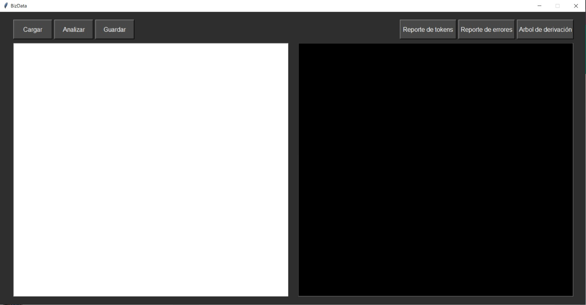
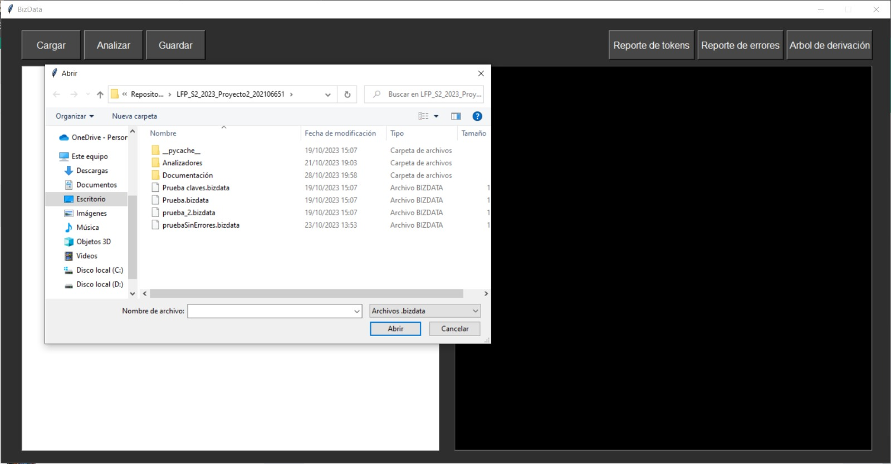
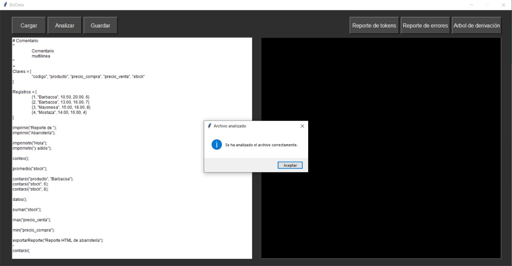
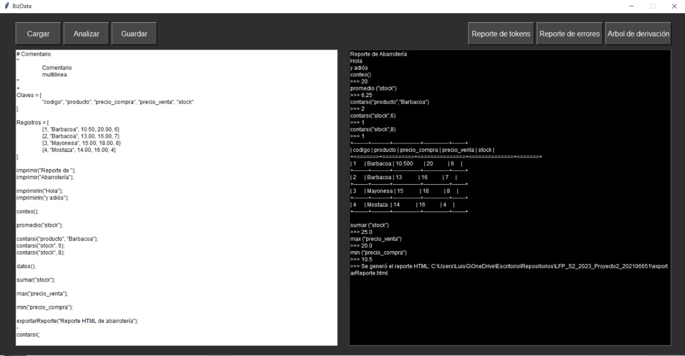
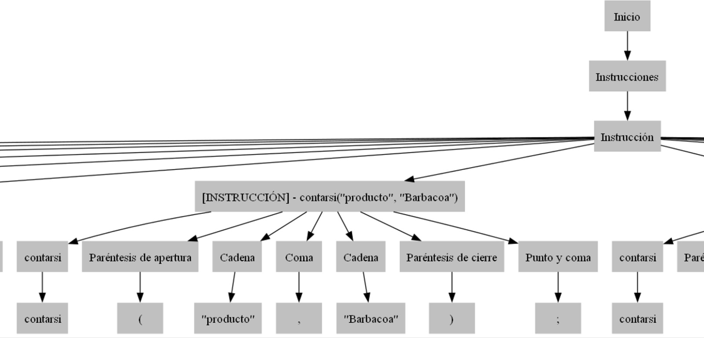
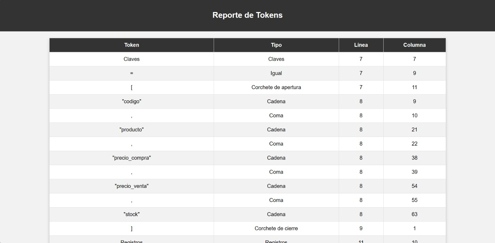

# MANUAL DE USUARIO
## Luis Carlos Corleto Marroquín
### Proyecto 2 - BizData
#### Menú principal

La aplicación cuenta con esta interfaz, en donde el usuario podrá interactuar para la analización de su archivo .bizdata.
La interfaz minimalista, formal y moderna hacer que sea fácil de entender, esta cuenta con 6 botones funcionales, 1 cuadro de texto y 1 cuadro de consola que no es editable, simplemente muestra los resultados.

El usuario deberá cargar el archivo mediante el botón cargar y seleccionar un archivo con extensión.bizdata, además está modificado para que solo se muestren los archivos con dicha extensión.

Una vez seleccionado el archivo, se muestra el contenido editable en la parte izquierda, que es el panel de texto, aquí el usuario elige agregar o quitar funcionalidades al archivo y tiene la opción de guardar lo que editó mediante el botón "Guardar", si el usuario considera que su archivo está como él desea, debe analizarlo con el botón "Analizar", si todo está correcto se mostrará un mensaje como se ve en la imágen, al dar click en aceptar, se mostrarán los resultados en la parte de la consola de la siguiente forma.

Aquí ya está el archivo analizado y el usuario podrá visualizar sus resultados en el cuadro de la consola no editable, aparecerán tantos resultados como funcionalidades haya agregado el mismo.

El usuario puede seleccionar los 3 botones de la parte derecha, que son archivos que se generan a partir de la analización, si presiona el "Arbol de derivación", mostrará la imágen del grafo que se generó en formato .svg.

Por último, se tiene los 2 botónes de reportes, errores y tokens, donde cada uno genera un HTML, con su respectiva lista de tokens y errores.