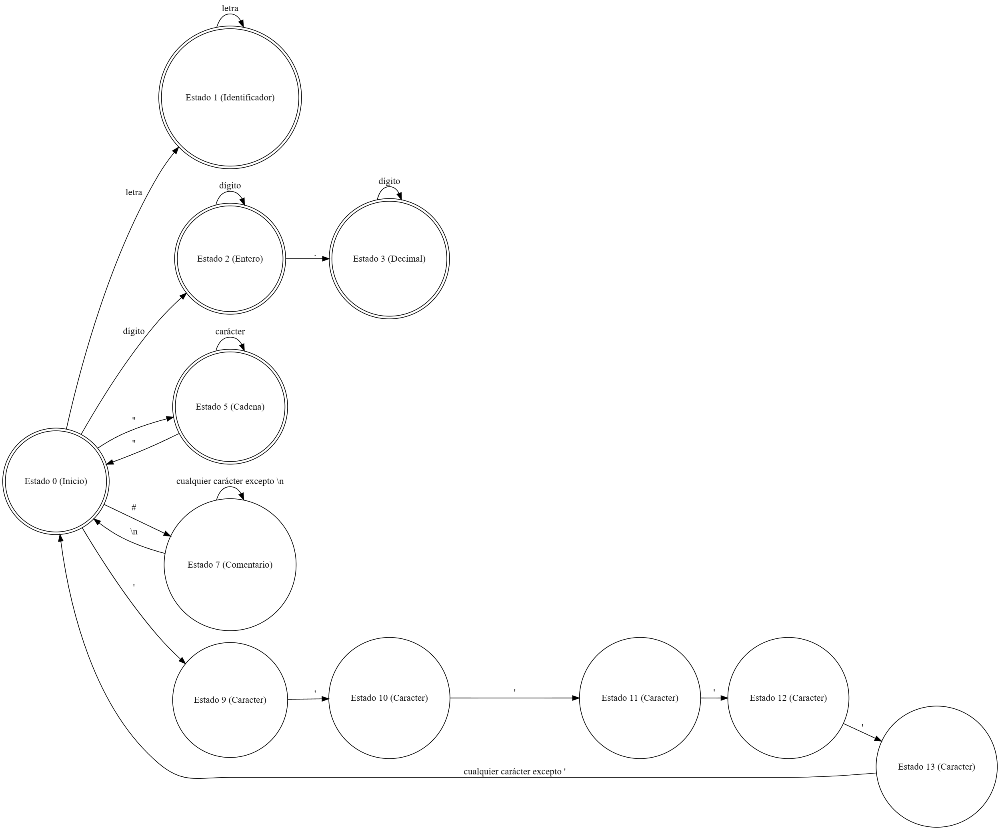

# MANUAL TÉCNICO
## Luis Carlos Corleto Marroquín
### Proyecto 2 - BizData
**OBJETIVOS**
* Que el estudiante implemente una solución de software, implementando los conceptos vistos en clase y laboratorio.
* Que el estudiante implemente un analizador sintáctico utilizando los conceptos de
gramáticas independientes de contexto y árboles de derivación.
* Introducir al estudiante a la ejecución de instrucciones en un lenguaje de programación.
### DESCRIPCIÓN
BizData (Business Data Analysis) es una plataforma diseñada para que las pequeñas empresas 
puedan tomar decisiones fundamentadas y estratégicas basadas en el análisis profundo de sus 
datos comerciales. La tarea del estudiante de Lenguajes Formales y de Programación es crear 
un analizador léxico y sintáctico, utilizando Python, que permita a las empresas cargar y analizar 
datos estructurados en un formato especializado con extensión “.bizdata”.
### ANALIZADOR LÉXICO:
#### Expresiones regulares
1. Identificadores(Tokens Alfabéticos):
    * Expresión: [a-zA-Z]+
2. Números enteros:
    * Expresión: [0-9]+
3. Números decimales:
    * Expresión: [0-9]+\.[0-9]+
4. Cadenas:
    * Expresión: ([^"]*)"
5. Comentarios de una sola línea:
    * Expresión: #.*\n
6. Caracteres entre comillas simples:
    * '(.)'
#### Método del Árbol
#### AFD

```
    def analyzer(self, cadena):
        self.tokensTable = []
        self.mistakesTable = []
        self.i = 0

        while self.i < len(cadena):
            if self.state == 0:
                if cadena[self.i].isalpha():
                    self.temporary += cadena[self.i]
                    self.column += 1
                    self.state = 1
                
                elif cadena[self.i].isdigit():
                    self.temporary += cadena[self.i]
                    self.column += 1
                    self.state = 2

                elif cadena[self.i] in self.symbols:
                    self.identifySymbol(cadena[self.i])
                
                elif cadena[self.i] == '"':
                    self.temporary += cadena[self.i]
                    self.column += 1
                    self.state = 5

                elif cadena[self.i] == '#':
                    self.temporary += cadena[self.i]
                    self.column += 1
                    self.state = 7

                elif cadena[self.i] == "'":
                    self.temporary += cadena[self.i]
                    self.column += 1
                    self.state = 9
                
                elif cadena[self.i] == '\n':
                    self.row += 1
                    self.column = 1

                elif cadena[self.i] in ['\t', ' ']:
                    self.column += 1

                elif cadena[self.i] == '\r':
                    pass

                else:
                    self.temporary += cadena[self.i]
                    self.addError(self.temporary, self.row, self.column)
                    self.column += 1

            elif self.state == 1:
                if cadena[self.i].isalpha():
                    self.temporary += cadena[self.i]
                    self.column += 1
                else:
                    if self.identifyReserved():
                        self.addToken(self.temporary.strip(), self.temporary.strip(), self.row, self.column)
                        self.state = 0
                        self.column += 1
                        self.i -=1
                    else:
                        self.addError(self.temporary, self.row, self.column)
                        self.state = 0
                        self.column += 1
                        self.i -= 1

            elif self.state == 2:
                if cadena[self.i].isdigit():
                    self.temporary += cadena[self.i]
                    self.column += 1

                elif cadena[self.i] == ".":
                    self.temporary += cadena[self.i]
                    self.column += 1
                    self.state = 3

                else:
                    self.addToken(self.temporary, 'Entero', self.row, self.column)
                    self.state = 0
                    self.column += 1
                    self.i -= 1

            elif self.state == 3:
                if cadena[self.i].isdigit():
                    self.temporary += cadena[self.i]
                    self.column += 1
                else:
                    self.addToken(self.temporary, 'Decimal', self.row, self.column)
                    self.state = 0
                    self.column += 1
                    self.i -= 1
            
            elif self.state == 5:
                if cadena[self.i] != "\"":
                    self.temporary += cadena[self.i]
                    self.column += 1
                else:
                    self.temporary += cadena[self.i]
                    self.addToken(self.temporary, "Cadena", self.row, self.column)
                    self.state = 0
                    self.column += 1

            elif self.state == 7:
                if cadena[self.i] == '\n':
                    self.state = 0
                    self.row += 1
                    self.column = 1
                else:
                    self.column += 1

            elif self.state == 9:
                if cadena[self.i] == "'":
                    self.temporary += cadena[self.i]
                    self.state = 10
                    self.column += 1
                else:
                    self.addError(self.temporary, self.row, self.column)
                    self.state = 0
                    self.column += 1
                    self.i -= 1

            elif self.state == 10:
                if cadena[self.i] == "'":
                    self.temporary += cadena[self.i]
                    self.state = 11
                    self.column += 1
                else:
                    self.addError(self.temporary, self.row, self.column)
                    self.state = 0
                    self.column += 1
                    self.i -= 1
            
            elif self.state == 11:
                if cadena[self.i] == "'":
                    self.temporary += cadena[self.i]
                    self.state = 12
                    self.column += 1
                elif cadena[self.i] == '\n':
                    self.temporary += cadena[self.i]
                    self.row += 1
                    self.column = 1
                else:
                    self.temporary += cadena[self.i]
                    self.column += 1
            
            elif self.state == 12:
                if cadena[self.i] == "'":
                    self.temporary += cadena[self.i]
                    self.state = 13
                    self.column += 1
                else:
                    self.addError(self.temporary, self.row, self.column)
                    self.state = 0
                    self.column += 1
                    self.i -= 1

            elif self.state == 13:
                if cadena[self.i] == "'":
                    self.temporary = ""
                    self.state = 0
                    self.column += 1
                else:
                    self.addError(self.temporary, self.row, self.column)
                    self.state = 0
                    self.column += 1
                    self.i -= 1

            self.i += 1
        return self.tokensTable, self.mistakes
```
#### Gramática independiente del contexto
S -> INSTRUCCIONES
INSTRUCCIONES -> INSTRUCCION INSTRUCCIONES 
               | ε
INSTRUCCION -> IMPRIMIR 
            | IMPRIMIRLN
            | CLAVES
            | REGISTROS
            | CONTEO
            | PROMEDIO
            | CONTARSI
            | DATOS
            | SUMAR
            | MAX
            | MIN
            | REPORTE
            
IMPRIMIR -> imprimir ( CADENA ) ; 
IMPRIMIRLN -> imprimirln ( CADENA ) ;
CLAVES -> Claves = [ CADENAS ] ;  
REGISTROS -> Registros = [ REGISTROS ] ;
REGISTROS -> { VALORES }
VALORES -> VALOR , VALORES
       | VALOR
VALOR -> CADENA
     | ENTERO
     | DECIMAL
CONTEO -> conteo ( ) ;
PROMEDIO -> promedio ( CADENA ) ;
CONTARSI -> contarsi ( CADENA , VALOR ) ;
DATOS -> datos ( ) ;  
SUMAR -> sumar ( CADENA ) ;
MAX -> max ( CADENA ) ;
MIN -> min ( CADENA ) ;
REPORTE -> exportarReporte ( CADENA ) ;

CADENAS -> CADENA , CADENAS
        | CADENA
CADENA -> " CADENA "
ENTERO -> DIGITO+
DECIMAL -> DIGITO+ . DIGITO+
### ANALIZADOR SINTÁCTICO
```
from graphviz import Digraph
from Instrucciones.ContarSi import ContarSi
from Instrucciones.Max import Max
from Instrucciones.Min import Min
from Instrucciones.Promedio import Promedio
from Instrucciones.Suma import Suma
from Reportes.ReporteHTML import reportHtml
from texttable import Texttable
import uuid, copy

class Sintáctico:
    def __init__(self, tokens = [], mistakes = []):
        self.mistakes = mistakes
        self.tokens = tokens
        self.tokens.reverse()
        self.reserved = ["CLAVES", "REGISTROS", "IMPRIMIR", "IMPRIMIRLN", "CONTEO", "PROMEDIO", "CONTARSI", "DATOS", "MAX", "MIN", "EXPORTARREPORTE", "SUMAR", "PUNTO Y COMA"]
        self.vector = []
        self.keys = []
        self.functionContarSi = ContarSi()
        self.functionMax = Max()
        self.functionMin = Min()
        self.functionPromedio = Promedio()
        self.functionSuma = Suma()
        self.reportHTML = reportHtml()
        self.temporary = ""
        self.graph = Digraph('Arbol de derivación', format='png')
        self.graph.attr(bgcolor='white', fontname='Helvetica', fontsize='12', rankdir='TB')
        self.graph.attr('node', shape='rectangle', style='filled', color='lightgray', fontcolor='black')
        self.start = ""
        self.nodeInstruction = ""

    def createNode(self, tag:str) -> str:
        id = str(uuid.uuid1())
        self.graph.node(id, tag, color='gray')
        return id
    
    def addNodeC(self, parentNode, childNode:str):
        self.graph.edge(parentNode, childNode, color='black')

    def addError(self, obtained, expected, row, column):
        self.mistakes.append(f"[ERROR SINTÁCTICO] Encontrado: '{obtained}', Se esperaba: '{expected}'. Fila: {row}, Columna: {column}")
        temp = self.tokens[-1]
        while temp.type.upper() not in self.reserved:
            temp = self.tokens.pop()

    def analyze(self):
        self.startAn()
        return(self.temporary, self.mistakes, self.graph)
    
    def startAn(self):
        self.start = self.createNode('Inicio')
        self.nodeInstruction = self.createNode('Instrucción')
        self.instructionsAn()

    def instructionsAn(self):
        instrucciones = self.createNode('Instrucciones')
        self.addNodeC(self.start, instrucciones)
        self.start = instrucciones
        self.addNodeC(self.start, self.nodeInstruction)

        self.instructionAn()
        self.instructionsAn2()

    def instructionsAn2(self):
        try:
            temp = self.tokens[-1]
            if temp.type.upper() in self.reserved:
                self.instructionAn()
                self.instructionsAn2()
            else:
                self.addError(temp.type, "Instrucción", temp.row, temp.column)
                self.instructionAn()
                self.instructionsAn2()
        except IndexError:
            pass
        except Exception:
            pass

    def instructionAn(self):
        try:
            temp = self.tokens[-1]
            if temp.type == 'imprimir':
                self.printAn()
            elif temp.type == 'imprimirln':
                self.printlnAn()
            elif temp.type == 'Claves':
                self.keysAn()
            elif temp.type == 'Registros':
                self.recordsAn()
            elif temp.type == 'conteo':
                self.countingAn()
            elif temp.type == 'promedio':
                self.averageAn()
            elif temp.type == 'contarsi':
                self.contarsiAn()
            elif temp.type == 'datos':
                self.dataAn()
            elif temp.type == 'sumar':
                self.sumarAn()
            elif temp.type == 'max':
                self.maxAn()
            elif temp.type == 'min':
                self.minAn()
            elif temp.type == 'exportarReporte':
                self.reportAn()
            else:
                pass
        except IndexError:
            pass
        except Exception:
            pass
    
    def printAn(self):
        temp = self.tokens.pop()
        if temp.type != "imprimir":
            self.tokens.append(temp)
            self.addError(temp.type, "imprimir", temp.row, temp.column)
            return

        printNd = temp.lexeme
        temp = self.tokens.pop()
        if temp.type != "Paréntesis de apertura":
            self.tokens.append(temp)
            self.addError(temp.type, "Paréntesis de apertura", temp.row, temp.column)
            return

        temp = self.tokens.pop()
        if temp.type != "Cadena":
            self.tokens.append(temp)
            self.addError(temp.type, "Cadena", temp.row, temp.column)
            return

        cadena = temp.lexeme.replace('"', '')
        self.temporary += cadena
        cadenaLx = temp.lexeme

        temp = self.tokens.pop()
        if temp.type != "Paréntesis de cierre":
            self.tokens.append(temp)
            self.addError(temp.type, "Paréntesis de cierre", temp.row, temp.column)
            return

        temp = self.tokens.pop()
        if temp.type != "Punto y coma":
            self.tokens.append(temp)
            self.addError(temp.type, "Punto y coma", temp.row, temp.column)
            return

        node0 = self.createNode('imprimir')
        node10 = self.createNode(printNd)
        self.addNodeC(node0, node10)
        node1 = self.createNode('Paréntesis de apertura')
        node2 = self.createNode('(')
        self.addNodeC(node1, node2)
        node3 = self.createNode('Cadena')
        node4 = self.createNode(cadenaLx)
        self.addNodeC(node3, node4)
        node5 = self.createNode('Paréntesis de cierre')
        node6 = self.createNode(')')
        self.addNodeC(node5, node6)
        node7 = self.createNode('Punto y coma')
        node8 = self.createNode(temp.lexeme)
        self.addNodeC(node7, node8)
        node9 = self.createNode(f'[INSTRUCCIÓN] - imprimir("{cadenaLx}")')
        self.addNodeC(node9, node0)
        self.addNodeC(node9, node1)
        self.addNodeC(node9, node3)
        self.addNodeC(node9, node5)
        self.addNodeC(node9, node7)
        self.addNodeC(self.nodeInstruction, node9)

    def printlnAn(self):
        cadena = None
        temp = self.tokens.pop()

        if temp.type != "imprimirln":
            self.tokens.append(temp)
            self.addError(temp.type, "imprimirln", temp.row, temp.column)
            return

        printNd = temp.lexeme
        temp = self.tokens.pop()

        if temp.type != "Paréntesis de apertura":
            self.tokens.append(temp)
            self.addError(temp.type, "Paréntesis de apertura", temp.row, temp.column)
            return

        parentesisAp = temp.lexeme
        temp = self.tokens.pop()

        if temp.type != "Cadena":
            self.tokens.append(temp)
            self.addError(temp.type, "Cadena", temp.row, temp.column)
            return

        cadenaLx = copy.deepcopy(temp.lexeme)
        cadena = temp.lexeme
        cadena = cadena.replace('"', '')
        self.temporary += "\n" + cadena
        temp = self.tokens.pop()

        if temp.type != "Paréntesis de cierre":
            self.tokens.append(temp)
            self.addError(temp.type, "Paréntesis de cierre", temp.row, temp.column)
            return

        parentesisCi = temp.lexeme
        temp = self.tokens.pop()

        if temp.type != "Punto y coma":
            self.tokens.append(temp)
            self.addError(temp.type, "Punto y coma", temp.row, temp.column)
            return

        node0 = self.createNode('imprimirln')
        node2 = self.createNode(printNd)
        self.addNodeC(node0, node2)
        node3 = self.createNode('Paréntesis de apertura')
        node4 = self.createNode(parentesisAp)
        self.addNodeC(node3, node4)
        node5 = self.createNode('Cadena')
        node6 = self.createNode(cadenaLx)
        self.addNodeC(node5, node6)
        node7 = self.createNode('Paréntesis de cierre')
        node8 = self.createNode(parentesisCi)
        self.addNodeC(node7, node8)
        node9 = self.createNode('Punto y coma')
        node10 = self.createNode(temp.lexeme)
        self.addNodeC(node9, node10)
        node11 = self.createNode(f'[INSTRUCCIÓN] - imprimirln("{cadenaLx}")')
        self.addNodeC(node11, node0)
        self.addNodeC(node11, node3)
        self.addNodeC(node11, node5)
        self.addNodeC(node11, node7)
        self.addNodeC(node11, node9)
        self.addNodeC(self.nodeInstruction, node11)

    def keysAn(self):
        rowTemp = []
        temp = self.tokens.pop()
        
        if temp.type != "Claves":
            self.tokens.append(temp)
            self.addError(temp.type, "Error", temp.row, temp.column)
            return
        
        temp = self.tokens.pop()
        if temp.type != "Igual":
            self.tokens.append(temp)
            self.addError(temp.type, "Igual", temp.row, temp.column)
            return
        
        temp = self.tokens.pop()
        if temp.type != "Corchete de apertura":
            self.tokens.append(temp)
            self.addError(temp.type, "Corchete de apertura", temp.row, temp.column)
            return
        
        while True:
            temp = self.tokens.pop()
            if temp.type == "Cadena":
                cadena = temp.lexeme.replace('"', '')
                rowTemp.append(cadena)
                
                temp = self.tokens.pop()
                if temp.type == "Corchete de cierre":
                    break
                elif temp.type != "Coma":
                    self.tokens.append(temp)
                    self.addError(temp.type, "Punto y coma - Corchete de cierre", temp.row, temp.column)
                    break
            else:
                self.tokens.append(temp)
                self.addError(temp.type, "Cadena", temp.row, temp.column)
                break
        
        self.keys = rowTemp

    def recordsAn(self):
        temp = self.tokens.pop()

        if temp.type != "Registros":
            self.tokens.append(temp)
            self.addError(temp.type, "Registros", temp.row, temp.column)
            return

        temp = self.tokens.pop()
        if temp.type != "Igual":
            self.tokens.append(temp)
            self.addError(temp.type, "Igual", temp.row, temp.column)
            return

        temp = self.tokens.pop()
        if temp.type != "Corchete de apertura":
            self.tokens.append(temp)
            self.addError(temp.type, "Corchete de apertura", temp.row, temp.column)
            return

        while True:
            temp = self.tokens.pop()
            if temp.type == "Llave de apertura":
                rowTemp = []
                fin = False
                while fin is False:
                    temp = self.tokens.pop()

                    if temp.type == "Cadena" or temp.type == "Decimal" or temp.type == "Entero":
                        cadena = temp.lexeme
                        cadena = cadena.replace('"', '')
                        rowTemp.append(cadena)

                        temp = self.tokens.pop()

                        if temp.type == "Coma":
                            continue
                        elif temp.type == "Llave de cierre":
                            fin = True
                        else:
                            self.tokens.append(temp)
                            self.addError(temp.type, "Coma - Llave de cierre", temp.row, temp.column)
                            break
                    else:
                        self.tokens.append(temp)
                        self.addError(temp.type, "Cadena", temp.row, temp.column)
                        break
                self.vector.append(rowTemp)

            elif temp.type == "Corchete de cierre":
                break
            else:
                self.tokens.append(temp)
                self.addError(temp.type, "Llave de apertura - Corchete de cierre", temp.row, temp.column)
                break

        if temp.type != "Corchete de cierre":
            self.tokens.append(temp)
            self.addError(temp.type, "Corchete de cierre", temp.row, temp.column)
            return

    def countingAn(self):
        temp = self.tokens.pop()

        if temp.type != "conteo":
            self.tokens.append(temp)
            self.addError(temp.type, "conteo", temp.row, temp.column)
            return

        count = temp.lexeme
        temp = self.tokens.pop()

        if temp.type != "Paréntesis de apertura":
            self.tokens.append(temp)
            self.addError(temp.type, "Paréntesis de apertura", temp.row, temp.column)
            return

        parentesisAp = temp.lexeme
        temp = self.tokens.pop()

        if temp.type != "Paréntesis de cierre":
            self.tokens.append(temp)
            self.addError(temp.type, "Paréntesis de cierre", temp.row, temp.column)
            return

        parentesisCi = temp.lexeme
        temp = self.tokens.pop()

        if temp.type != "Punto y coma":
            self.tokens.append(temp)
            self.addError(temp.type, "Punto y coma", temp.row, temp.column)
            return

        rows = len(self.vector)
        columns = len(self.vector[0])
        count = int(rows) * int(columns)

        self.temporary += "\nconteo()"
        self.temporary += "\n>>> " + str(count)

        node0 = self.createNode('conteo')
        node1 = self.createNode(str(count))
        node2 = self.createNode('Paréntesis de apertura')
        node3 = self.createNode(parentesisAp)
        node4 = self.createNode('Paréntesis de cierre')
        node5 = self.createNode(parentesisCi)
        node7 = self.createNode('Punto y coma')
        node8 = self.createNode(temp.lexeme)
        node9 = self.createNode(f'[INSTRUCCIÓN] - conteo())')

        self.addNodeC(node0, node1)
        self.addNodeC(node2, node3)
        self.addNodeC(node4, node5)
        self.addNodeC(node7, node8)
        self.addNodeC(node9, node0)
        self.addNodeC(node9, node2)
        self.addNodeC(node9, node4)
        self.addNodeC(node9, node7)
        self.addNodeC(self.nodeInstruction, node9)

    def averageAn(self):
        cadena = None
        temp = self.tokens.pop()

        if temp.type != "promedio":
            self.tokens.append(temp)
            self.addError(temp.type, "promedio", temp.row, temp.column)
            return

        average = temp.lexeme
        temp = self.tokens.pop()

        if temp.type != "Paréntesis de apertura":
            self.tokens.append(temp)
            self.addError(temp.type, "Paréntesis de apertura", temp.row, temp.column)
            return

        parentesisAp = temp.lexeme
        temp = self.tokens.pop()

        if temp.type != "Cadena":
            self.tokens.append(temp)
            self.addError(temp.type, "Cadena", temp.row, temp.column)
            return

        cadenaLx = temp.lexeme
        cadena = temp.lexeme
        temp = self.tokens.pop()

        if temp.type != "Paréntesis de cierre":
            self.tokens.append(temp)
            self.addError(temp.type, "Paréntesis de cierre", temp.row, temp.column)
            return

        parentesisCi = temp.lexeme
        temp = self.tokens.pop()

        if temp.type != "Punto y coma":
            self.tokens.append(temp)
            self.addError(temp.type, "Punto y coma", temp.row, temp.column)
            return

        res = self.functionPromedio.promedio(self.vector, self.keys, cadena)
        if res is None:
            print("Error")
        else:
            self.temporary += "\npromedio (" + cadenaLx + ")"
            self.temporary += "\n>>> " + res

            node0 = self.createNode('promedio')
            node1 = self.createNode(average)
            self.addNodeC(node0, node1)

            node2 = self.createNode('Paréntesis de apertura')
            node3 = self.createNode(parentesisAp)
            self.addNodeC(node2, node3)

            node4 = self.createNode('Cadena')
            node5 = self.createNode(cadenaLx)
            self.addNodeC(node4, node5)

            node6 = self.createNode('Paréntesis de cierre')
            node7 = self.createNode(parentesisCi)
            self.addNodeC(node6, node7)

            node8 = self.createNode('Punto y coma')
            node9 = self.createNode(temp.lexeme)
            self.addNodeC(node8, node9)

            node10 = self.createNode(f'[INSTRUCCIÓN] - promedio({cadenaLx})')
            self.addNodeC(node10, node0)
            self.addNodeC(node10, node2)
            self.addNodeC(node10, node4)
            self.addNodeC(node10, node6)
            self.addNodeC(node10, node8)
            self.addNodeC(self.nodeInstruction, node10)

    def contarsiAn(self):
        field = None
        value = None
        temp = self.tokens.pop()

        if temp.type != "contarsi":
            self.tokens.append(temp)
            self.addError(temp.type, "contarsi", temp.row, temp.column)
            return

        contarsi = temp.lexeme
        temp = self.tokens.pop()

        if temp.type != "Paréntesis de apertura":
            self.tokens.append(temp)
            self.addError(temp.type, "Paréntesis de apertura", temp.row, temp.column)
            return

        parentesisAp = temp.lexeme
        temp = self.tokens.pop()

        if temp.type != "Cadena":
            self.tokens.append(temp)
            self.addError(temp.type, "Cadena", temp.row, temp.column)
            return

        cadena1 = temp.lexeme
        field = temp.lexeme
        temp = self.tokens.pop()

        if temp.type != "Coma":
            self.tokens.append(temp)
            self.addError(temp.type, "Coma", temp.row, temp.column)
            return

        comma = temp.lexeme
        temp = self.tokens.pop()                         

        if temp.type not in ["Cadena", "Decimal", "Entero"]:
            self.tokens.append(temp)
            self.addError(temp.type, "Cadena - Decimal - Entero", temp.row, temp.column)
            return

        value = temp.lexeme
        cadena2 = temp.lexeme
        temp = self.tokens.pop()

        if temp.type != "Paréntesis de cierre":
            self.tokens.append(temp)
            self.addError(temp.type, "Paréntesis de cierre", temp.row, temp.column)
            return

        parentesisCi = temp.lexeme
        temp = self.tokens.pop()

        if temp.type != "Punto y coma":
            self.tokens.append(temp)
            self.addError(temp.type, "Punto y coma", temp.row, temp.column)
            return

        res = self.functionContarSi.contarSi(self.vector, self.keys, field, value)
        if res is None:
            print("Error en contarSi")
        else:
            self.temporary += "\ncontarsi(" + cadena1 + "," + cadena2 + ")"
            self.temporary += "\n>>> " + res
            node0 = self.createNode('contarsi')
            node1 = self.createNode(contarsi)
            self.addNodeC(node0, node1)
            node2 = self.createNode('Paréntesis de apertura')
            node3 = self.createNode(parentesisAp)
            self.addNodeC(node2, node3)
            node4 = self.createNode('Cadena')
            node5 = self.createNode(cadena1)
            self.addNodeC(node4, node5)
            node6 = self.createNode('Coma')
            node7 = self.createNode(comma)
            self.addNodeC(node6, node7)
            node8 = self.createNode('Cadena')
            node9 = self.createNode(cadena2)
            self.addNodeC(node8, node9)
            node10 = self.createNode('Paréntesis de cierre')
            node11 = self.createNode(parentesisCi)
            self.addNodeC(node10, node11)
            node12 = self.createNode('Punto y coma')
            node13 = self.createNode(temp.lexeme)
            self.addNodeC(node12, node13)
            node14 = self.createNode(f'[INSTRUCCIÓN] - contarsi({cadena1}, {cadena2})')
            self.addNodeC(node14, node0)
            self.addNodeC(node14, node2)
            self.addNodeC(node14, node4)
            self.addNodeC(node14, node6)
            self.addNodeC(node14, node8)
            self.addNodeC(node14, node10)
            self.addNodeC(node14, node12)
            self.addNodeC(self.nodeInstruction, node14)

    def dataAn(self):
        temp = self.tokens.pop()

        if temp.type != "datos":
            self.tokens.append(temp)
            self.addError(temp.type, "datos", temp.row, temp.column)
            return

        data = temp.lexeme
        temp = self.tokens.pop()

        if temp.type != "Paréntesis de apertura":
            self.tokens.append(temp)
            self.addError(temp.type, "Parénteisis de apertura", temp.row, temp.column)
            return

        parentesisAp = temp.lexeme
        temp = self.tokens.pop()

        if temp.type != "Paréntesis de cierre":
            self.tokens.append(temp)
            self.addError(temp.type, "Paréntesis de cierre", temp.row, temp.column)
            return

        parentesisCi = temp.lexeme
        temp = self.tokens.pop()

        if temp.type != "Punto y coma":
            self.tokens.append(temp)
            self.addError(temp.type, "Punto y coma", temp.row, temp.column)
            return

        self.impTabla()

        node0 = self.createNode('datos')
        node1 = self.createNode(data)
        node2 = self.createNode('Paréntesis de apertura')
        node3 = self.createNode(parentesisAp)
        node4 = self.createNode('Paréntesis de cierre')
        node5 = self.createNode(parentesisCi)
        node6 = self.createNode('Punto y coma')
        node7 = self.createNode(temp.lexeme)
        node8 = self.createNode(f'[INSTRUCCIÓN] - datos()')

        self.addNodeC(node0, node1)
        self.addNodeC(node2, node3)
        self.addNodeC(node4, node5)
        self.addNodeC(node6, node7)
        self.addNodeC(node8, node0)
        self.addNodeC(node8, node2)
        self.addNodeC(node8, node4)
        self.addNodeC(node8, node6)
        self.addNodeC(self.nodeInstruction, node8)

    def sumarAn(self):
        cadena = None
        temp = self.tokens.pop()

        if temp.type != "sumar":
            self.tokens.append(temp)
            self.addError(temp.type, "sumar", temp.row, temp.column)
            return

        sum = temp.lexeme
        temp = self.tokens.pop()

        if temp.type != "Paréntesis de apertura":
            self.tokens.append(temp)
            self.addError(temp.type, "Paréntesis de apertura", temp.row, temp.column)
            return

        parentesisAp = temp.lexeme
        temp = self.tokens.pop()

        if temp.type != "Cadena":
            self.tokens.append(temp)
            self.addError(temp.type, "Cadena", temp.row, temp.column)
            return

        cadenaLx = temp.lexeme
        cadena = temp.lexeme
        temp = self.tokens.pop()

        if temp.type != "Paréntesis de cierre":
            self.tokens.append(temp)
            self.addError(temp.type, "Paréntesis de cierre", temp.row, temp.column)
            return

        parentesisCi = temp.lexeme
        temp = self.tokens.pop()

        if temp.type != "Punto y coma":
            self.tokens.append(temp)
            self.addError(temp.type, "Punto y coma", temp.row, temp.column)
            return

        res = self.functionSuma.sumar(self.vector, self.keys, cadena)

        if res is None:
            print("Error en suma")
        else:
            self.temporary += "\nsumar (" + cadenaLx + ")"
            self.temporary += "\n>>> " + res

            node0 = self.createNode('sumar')
            node1 = self.createNode(sum)
            node2 = self.createNode('Paréntesis de apertura')
            node3 = self.createNode(parentesisAp)
            node4 = self.createNode('Cadena')
            node5 = self.createNode(cadenaLx)
            node6 = self.createNode('Paréntesis de cierre')
            node7 = self.createNode(parentesisCi)
            node8 = self.createNode('Punto y coma')
            node9 = self.createNode(temp.lexeme)
            node10 = self.createNode(f'[INSTRUCCIÓN] - sumar({cadenaLx})')

            self.addNodeC(node0, node1)
            self.addNodeC(node2, node3)
            self.addNodeC(node4, node5)
            self.addNodeC(node6, node7)
            self.addNodeC(node8, node9)
            self.addNodeC(node10, node0)
            self.addNodeC(node10, node2)
            self.addNodeC(node10, node4)
            self.addNodeC(node10, node6)
            self.addNodeC(node10, node8)
            self.addNodeC(self.nodeInstruction, node10)
    
    def maxAn(self):
        cadena = None
        temp = self.tokens.pop()

        if temp.type != "max":
            self.tokens.append(temp)
            self.addError(temp.type, "max", temp.row, temp.column)
            return

        maximum = temp.lexeme
        temp = self.tokens.pop()

        if temp.type != "Paréntesis de apertura":
            self.tokens.append(temp)
            self.addError(temp.type, "Paréntesis de apertura", temp.row, temp.column)
            return

        parentesisAp = temp.lexeme
        temp = self.tokens.pop()

        if temp.type != "Cadena":
            self.tokens.append(temp)
            self.addError(temp.type, "Cadena", temp.row, temp.column)
            return

        cadenaLx = temp.lexeme
        cadena = temp.lexeme
        temp = self.tokens.pop()

        if temp.type != "Paréntesis de cierre":
            self.tokens.append(temp)
            self.addError(temp.type, "Paréntesis de cierre", temp.row, temp.column)
            return

        parentesisCi = temp.lexeme
        temp = self.tokens.pop()

        if temp.type != "Punto y coma":
            self.tokens.append(temp)
            self.addError(temp.type, "Punto y coma", temp.row, temp.column)
            return

        res = self.functionMax.max(self.vector, self.keys, cadena)
        if res is None:
            print("Error en max")
        else:
            self.temporary += "\nmax (" + cadenaLx + ")"
            self.temporary += "\n>>> " + res
            node0 = self.createNode('max')
            node1 = self.createNode(maximum)
            self.addNodeC(node0, node1)
            node2 = self.createNode('Paréntesis de apertura')
            node3 = self.createNode(parentesisAp)
            self.addNodeC(node2, node3)
            node4 = self.createNode('Cadena')
            node5 = self.createNode(cadenaLx)
            self.addNodeC(node4, node5)
            node6 = self.createNode('Paréntesis de cierre')
            node7 = self.createNode(parentesisCi)
            self.addNodeC(node6, node7)
            node8 = self.createNode('Punto y coma')
            node9 = self.createNode(temp.lexeme)
            self.addNodeC(node8, node9)
            node10 = self.createNode(f'[INSTRUCCIÓN] - max({cadenaLx})')
            self.addNodeC(node10, node0)
            self.addNodeC(node10, node2)
            self.addNodeC(node10, node4)
            self.addNodeC(node10, node6)
            self.addNodeC(node10, node8)
            self.addNodeC(self.nodeInstruction, node10)

    def minAn(self):
        cadena = None
        temp = self.tokens.pop()
        if temp.type != "min":
            self.tokens.append(temp)
            self.addError(temp.type, "min", temp.row, temp.column)
            return

        minimum = temp.lexeme
        temp = self.tokens.pop()

        if temp.type != "Paréntesis de apertura":
            self.tokens.append(temp)
            self.addError(temp.type, "Paréntesis de apertura", temp.row, temp.column)
            return

        parentesisAp = temp.lexeme
        temp = self.tokens.pop()

        if temp.type != "Cadena":
            self.tokens.append(temp)
            self.addError(temp.type, "Cadena", temp.row, temp.column)
            return

        cadenaLx = temp.lexeme
        cadena = temp.lexeme
        temp = self.tokens.pop()

        if temp.type != "Paréntesis de cierre":
            self.tokens.append(temp)
            self.addError(temp.type, "Paréntesis de cierre", temp.row, temp.column)
            return

        parentesisCi = temp.lexeme
        temp = self.tokens.pop()

        if temp.type != "Punto y coma":
            self.tokens.append(temp)
            self.addError(temp.type, "Punto y coma", temp.row, temp.column)
            return

        res = self.functionMin.min(self.vector, self.keys, cadena)
        if res is None:
            print("Error en min")
        else:
            self.temporary += "\nmin (" + cadenaLx + ")"
            self.temporary += "\n>>> " + res
            node0 = self.createNode('min')
            node1 = self.createNode(minimum)
            self.addNodeC(node0, node1)
            node2 = self.createNode('Paréntesis de apertura')
            node3 = self.createNode(parentesisAp)
            self.addNodeC(node2, node3)
            node4 = self.createNode('Cadena')
            node5 = self.createNode(cadenaLx)
            self.addNodeC(node4, node5)
            node6 = self.createNode('Paréntesis de cierre')
            node7 = self.createNode(parentesisCi)
            self.addNodeC(node6, node7)
            node8 = self.createNode('Punto y coma')
            node9 = self.createNode(temp.lexeme)
            self.addNodeC(node8, node9)
            node10 = self.createNode(f'[INSTRUCCIÓN] - min({cadenaLx})')
            self.addNodeC(node10, node0)
            self.addNodeC(node10, node2)
            self.addNodeC(node10, node4)
            self.addNodeC(node10, node6)
            self.addNodeC(node10, node8)
            self.addNodeC(self.nodeInstruction, node10)

    def reportAn(self):
        cadena = None
        temp = self.tokens.pop()

        if temp.type != "exportarReporte":
            self.tokens.append(temp)
            self.addError(temp.type, "exportarReporte", temp.row, temp.column)
            return

        report = temp.lexeme
        temp = self.tokens.pop()

        if temp.type != "Paréntesis de apertura":
            self.tokens.append(temp)
            self.addError(temp.type, "Paréntesis de apertura", temp.row, temp.column)
            return

        parentesisAp = temp.lexeme
        temp = self.tokens.pop()

        if temp.type != "Cadena":
            self.tokens.append(temp)
            self.addError(temp.type, "Cadena", temp.row, temp.column)
            return

        cadena = temp.lexeme
        cadenaLx = temp.lexeme
        temp = self.tokens.pop()

        if temp.type != "Paréntesis de cierre":
            self.tokens.append(temp)
            self.addError(temp.type, "Paréntesis de cierre", temp.row, temp.column)
            return

        parentesisCi = temp.lexeme
        temp = self.tokens.pop()

        if temp.type != "Punto y coma":
            self.tokens.append(temp)
            self.addError(temp.type, "Punto y coma", temp.row, temp.column)
            return

        report = self.reportHTML.reportHTML(cadena, self.keys, self.vector)
        self.temporary += report
        node0 = self.createNode('exportarReporte')
        node1 = self.createNode(report)
        self.addNodeC(node0, node1)
        node2 = self.createNode('Paréntesis de apertura')
        node3 = self.createNode(parentesisAp)
        self.addNodeC(node2, node3)
        node4 = self.createNode('Cadena')
        node5 = self.createNode(cadenaLx)
        self.addNodeC(node4, node5)
        node6 = self.createNode('Paréntesis de cierre')
        node7 = self.createNode(parentesisCi)
        self.addNodeC(node6, node7)
        node8 = self.createNode('Punto y coma')
        node9 = self.createNode(temp.lexeme)
        self.addNodeC(node8, node9)
        node10 = self.createNode('[INSTRUCCIÓN] - exportarReporte()')
        self.addNodeC(node10, node0)
        self.addNodeC(node10, node2)
        self.addNodeC(node10, node4)
        self.addNodeC(node10, node6)
        self.addNodeC(node10, node8)
        self.addNodeC(self.nodeInstruction, node10)
    
    def impTabla(self):
        if len(self.keys) == 0 or len(self.vector) == 0:
            self.temporary += '\nNo hay valores en la tabla.\n'
        else:
            table = Texttable()
            table.header(self.keys)
            
            for row in self.vector:
                table.add_row(row)
            self.temporary += '\n' + table.draw() + '\n'
```
La función comienza inicializando las variables field y value como None y luego toma el token actual de la lista self.tokens y lo almacena en la variable temp.

Comprueba si el tipo del token en temp es igual a "contarsi". Si no lo es, se coloca el token nuevamente en la lista self.tokens y se agrega un error al registro de errores. Luego, la función sale.

Luego, la función verifica si el siguiente token es un "Paréntesis de apertura". Si no lo es, nuevamente coloca el token en la lista self.tokens y agrega un error al registro de errores antes de salir.

La función procede a verificar si el siguiente token es una "Cadena" y almacena su valor en las variables cadena1 y field.

Luego, se verifica si el siguiente token es una coma (","). Si no lo es, se maneja de manera similar como los pasos anteriores, agregando el token nuevamente y registrando un error.

La función verifica si el token siguiente es una "Cadena", "Decimal" o "Entero". Si no es ninguno de estos tipos, coloca el token en la lista y agrega un error.

Después, se verifica si el siguiente token es un "Paréntesis de cierre". De lo contrario, se coloca el token en la lista y se agrega un error.

Finalmente, la función verifica si el siguiente token es un "Punto y coma". Si no lo es, el token se coloca en la lista y se agrega un error.

Después de todas estas comprobaciones, se realiza un cálculo utilizando la función self.functionContarSi.contarSi y se almacena el resultado en la variable res.

Dependiendo de si res es None o no, se imprime un mensaje de error o se construye una cadena en la variable self.temporary.

Se crean nodos para construir un árbol sintáctico o similar, y se almacenan en variables como node0, node1, etc., utilizando la función self.createNode. Luego, estos nodos se enlazan para representar la estructura de la instrucción.

Finalmente, se agrega un nodo de instrucción a la estructura de árbol self.nodeInstruction, que parece ser parte de un analizador más grande.
### FUNCIONES
Se coloca una función como ejemplo.
#### Función promedio
```
class Suma:
    def sumar(self, records, keys, field):
        field = field.replace('"', '')

        try:
            index = keys.index(field)
        except ValueError:
            return None

        suma = 0
        for record in records:
            try:
                suma += float(record[index])
            except (ValueError, TypeError):
                return "No se pueden sumar valores no numéricos."

        return str(round(suma, 2))
```
Elimina las comillas dobles (") del valor del campo field.

Intenta encontrar el índice de field en la lista keys. Si field no se encuentra en keys, devuelve None.

Inicializa una variable llamada suma en cero.

Luego, realiza un bucle a través de los elementos en la lista records. En cada iteración, intenta sumar el valor numérico correspondiente al campo field (identificado por el índice) al valor acumulado en suma. Si el valor no es numérico (se produce una excepción de tipo ValueError o TypeError), se devuelve un mensaje de error.

Al final, el método devuelve la suma total de los valores numéricos en records redondeada a dos decimales como una cadena, o un mensaje de error si hubo problemas durante la suma.
### REPORTES
Se coloca un reporte como ejemplo:
```
import os

class reportMistakes():
    def __init__(self):
        pass

    def reportMistakes(self, mistakesTable):
        html = """<!DOCTYPE html>
                <html lang="en">
                <head>
                    <meta charset="utf-8">
                    <meta name="viewport" content="width=device-width, initial-scale=1, shrink-to-fit=no">
                    <title>Reporte de Errores</title>
                    <style>
                        body {
                            margin: 0;
                            padding: 0;
                            font-family: Arial, sans-serif;
                            background-color: #f2f2f2;
                        }

                        header {
                            background-color: #333;
                            color: #fff;
                            text-align: center;
                            padding: 20px;
                        }

                        h1 {
                            font-size: 24px;
                        }

                        table {
                            width: 80%;
                            margin: 20px auto;
                            background-color: #fff;
                            border-collapse: collapse;
                            box-shadow: 0 4px 8px 0 rgba(0, 0, 0, 0.2);
                        }

                        th, td {
                            text-align: center;
                            padding: 12px;
                            border: 1px solid #ddd;
                        }

                        th {
                            background-color: #333;
                            color: #fff;
                        }

                        tr:nth-child(even) {
                            background-color: #f2f2f2;
                        }
                    </style>
                </head>
                <body>
                <header>
                    <h1>Reporte de Errores</h1>
                </header>

                <table>
                    <thead>
                        <tr>
                            <th><strong>Error</strong></th>
                        </tr>
                    </thead>
                    <tbody>
                    """
        for error in mistakesTable:
            html += """<tr>
                    <td>""" + str(error).replace("<", "&lt;").replace(">", "&gt;") + """</td>
                    </tr>"""
        html += """ 
                </tbody>
                </table>
                </body>
                </html>"""
        current_dir = os.getcwd()
        file_path = os.path.join(current_dir, "Errores.html")
        with open(file_path, "w+", encoding="utf-8") as archivo:
            archivo.write(html)
        abs_file_path = os.path.abspath(file_path)
        return f"\n>>> Se generó el reporte HTML: {abs_file_path}"
```
Crea una estructura HTML que contiene un encabezado y una tabla para mostrar los errores. Define estilos básicos en línea para la apariencia de la página.

Luego, itera a través de la lista de errores (mistakesTable) y los agrega a la tabla HTML, escapando los caracteres < y > para que se muestren correctamente en la página.

Después de completar la tabla HTML, el código guarda el HTML generado en un archivo llamado "Errores.html" en el directorio actual.

Retorna un mensaje que indica que se ha generado con éxito el reporte HTML y proporciona la ruta absoluta al archivo generado.
### APLICACIÓN (Interfaz)
```
import tkinter as tk
from tkinter import *
from tkinter import filedialog
from tkinter import messagebox
from tkinter import Text
from Reportes.ReporteErrores import reportMistakes
from Reportes.ReporteTokens import reportTokens
from AnalizadorLéxico import *
from AnalizadorSintáctico import *
import os, webbrowser

bg_color = "#2E2E2E"
fg_color = "#FFFFFF" 

reportError = reportMistakes()
ReporteTokens = reportTokens()

class Interfaz:
    def __init__(self):
        self.ventana = Tk()
        self.ventana.title("Analizador")
        self.ventana.config(bg=bg_color)
        self.fuente1 = ("Helvetica", 9)
        self.fuente2 = ("Helvetica", 12)
        self.area_texto = Text(self.ventana, font=self.fuente1)
        self.area_consola = Text(self.ventana, font=self.fuente1)
        self.area_texto.grid(row=0, column=0, padx=10, pady=10)
        self.area_consola.grid(row=0, column=1, padx=10, pady=10)
        self.archivo_analizado = False
        self.archivo_analizado = False
        self.ruta = ''
        self.contenido = ''
        self.mistakesTable = []
        self.tokensTable = []
        self.tree = None

    def ventana_principal(self):
        self.ventana.title('BizData')
        self.centrar_ventana()
        self.ventana.resizable(False, False)
        self.componentes()
        self.ventana.mainloop()

    def centrar_ventana(self):
        w, h = 1500, 750
        w_pantalla = self.ventana.winfo_screenwidth()
        h_pantalla = self.ventana.winfo_screenheight()
        x = ((w_pantalla / 2) - (w / 2))
        y = ((h_pantalla / 2) - (h / 2)) - 50
        self.ventana.geometry(f'{w}x{h}+{int(x)}+{int(y)}')

    def componentes(self):
        self.botones()
        self.editor()
        self.consola()

    def botones(self):

        cargar = Button(self.ventana, text='Cargar', width=10, height=2, bg="#474747", fg=fg_color, font=self.fuente2, command=self.botónCargar)
        cargar.place(x=35, y=20)

        analizar = Button(self.ventana, text='Analizar', width=10, height=2, bg="#474747", fg=fg_color, font=self.fuente2, command=self.botónAnalizar)
        analizar.place(x=140, y=20)

        guardar = Button(self.ventana, text='Guardar', width=10, height=2, bg="#474747", fg=fg_color, font=self.fuente2, command=self.botónGuardar)
        guardar.place(x=245, y=20)

        token = Button(self.ventana, text='Reporte de tokens', width=15, height=2, bg="#474747", fg=fg_color, font=self.fuente2, command=self.botónReporteTokens)
        token.place(x=1025, y=20)

        error = Button(self.ventana, text='Reporte de errores', width=15, height=2, bg="#474747", fg=fg_color, font=self.fuente2, command=self.botónReporteErrores)
        error.place(x=1175, y=20)

        grafica = Button(self.ventana, text='Arbol de derivación', width=15, height=2, bg="#474747", fg=fg_color, font=self.fuente2, command=self.botónGrafo)
        grafica.place(x=1325, y=20)

    def editor(self):
        self.area_texto.configure(width=100, height=43)
        self.area_texto.place(x=35, y=80)

    def consola(self):
        self.area_consola.configure(bg='black', fg='white', width=100, height=43)
        self.area_consola.place(x=765, y=80)

    def botónCargar(self):
        tipos_archivos = [("Archivos .bizdata", "*.bizdata"), ("Todos los archivos", "*.*")]
        archivo = filedialog.askopenfilename(filetypes=tipos_archivos)

        if archivo:
            if archivo.endswith(".bizdata"):
                self.ruta = archivo
                self.area_texto.delete("1.0", "end")
                try:
                    with open(archivo, "r", encoding="utf-8") as document:
                        contenido = document.read()
                        self.area_texto.insert("1.0", contenido)
                except Exception as e:
                    messagebox.showerror("Error", f"No se pudo cargar el archivo:\n{str(e)}")
            else:
                messagebox.showerror("Error", "Seleccione un archivo con extensión .bizdata")

    def botónAnalizar(self):
        try:
            if not self.ruta:
                messagebox.showerror("Error", "Primero debe cargar un archivo.")
                return
            
            text = self.area_texto.get("1.0", "end")
            analyzeLéxico = Léxico()
            listPars = analyzeLéxico.analyzer(text)

            parser = Sintáctico(listPars[0], listPars[1])
            self.tokensTable = copy.deepcopy(listPars[0])
            output = parser.analyze()
            messagebox.showinfo("Archivo analizado", "Se ha analizado el archivo correctamente.")
            self.area_consola.insert(tk.END, output[0])
            self.mistakesTable = output[1]
            self.tree = output[2]
            self.archivo_analizado = True
            self.area_consola.configure(state="disabled")
        except Exception as e:
            messagebox.showerror("Error", "No se pudo analizar el archivo.")
            print(e)
    
    def botónGuardar(self):
        if not self.ruta:
            messagebox.showerror("Error", "Primero debe cargar un archivo.")
            return
        
        nuevo_contenido = self.area_texto.get("1.0", "end")
        
        try:
            with open(self.ruta, "w", encoding="utf-8") as document:
                document.write(nuevo_contenido)
            messagebox.showinfo("Guardado", "Cambios guardados correctamente.")
        except Exception as e:
            messagebox.showerror("Error", f"No se pudo guardar el archivo:\n{str(e)}")

    def botónReporteTokens(self):
        if not self.archivo_analizado:
            messagebox.showerror("Error", "Primero debe analizar un archivo.")
            return
        ReporteTokens.reportTokens(reversed(self.tokensTable))
        self.abrirArchivo("Reporte Tokens.html")

    def botónReporteErrores(self):
        if not self.archivo_analizado:
            messagebox.showerror("Error", "Primero debe analizar un archivo.")
            return
        reportError.reportMistakes(self.mistakesTable)
        self.abrirArchivo("Errores.html")

    def botónGrafo(self):
        if not self.archivo_analizado:
            messagebox.showerror("Error", "Primero debe analizar un archivo.")
            return
        self.tree.view()
    
    def abrirArchivo(self, nombreArchivo):
        try:
            rutaCompleta = os.path.abspath(nombreArchivo)
            webbrowser.open("file://" + rutaCompleta)
        except Exception as ex:
            messagebox.showerror("Error", f"No se pudo abrir el archivo. Error: {str(ex)}")

app = Interfaz()
app.ventana_principal()
```
La interfaz gráfica utiliza elementos de tkinter para crear ventanas, botones, áreas de texto y consolas.

Permite cargar un archivo con extensión ".bizdata" y muestra su contenido en un área de texto.

Tiene botones para realizar las siguientes acciones:

* Cargar: Permite seleccionar un archivo ".bizdata" y cargar su contenido en el área de texto.
* Analizar: Realiza un análisis léxico y sintáctico del código fuente en el área de texto. Muestra los resultados en una consola.
* Guardar: Guarda los cambios realizados en el contenido del archivo.
* Reporte de Tokens: Genera un informe de tokens y lo muestra en un archivo HTML. Permite abrir el informe en el navegador.
* Reporte de Errores: Genera un informe de errores léxicos y sintácticos y lo muestra en un archivo HTML. También permite abrir el informe en el navegador.
* Árbol de Derivación: Genera y muestra un árbol de derivación si el análisis se realizó con éxito.
El código utiliza clases y métodos para organizar la funcionalidad de la interfaz y los informes de tokens y errores.

La interfaz utiliza estilos de colores definidos para el fondo y el texto.

El código maneja la carga, análisis y generación de informes de archivos de código fuente.

La interfaz es redimensionable y se centra en la ventana del sistema.


